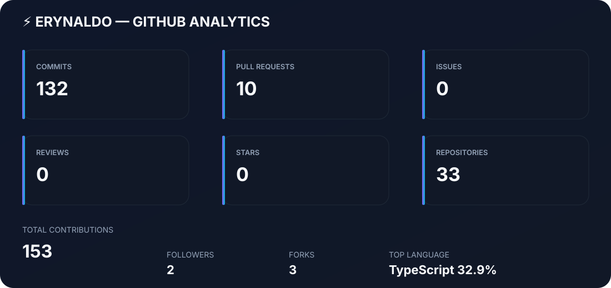
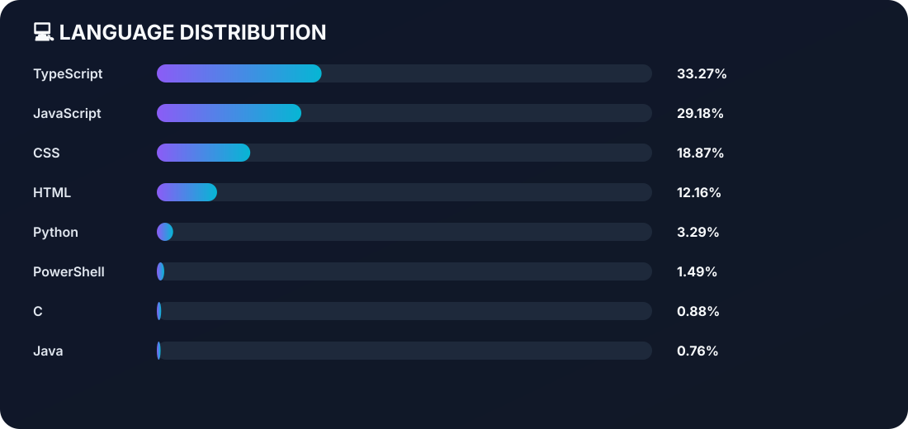
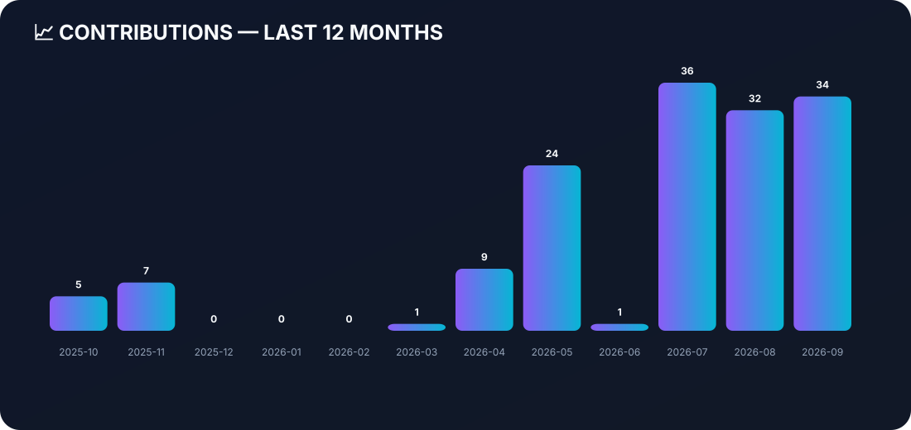

<!-- <h1 align="center">👋 Olá, bem vindo!</h1> -->

## 👋 Olá, bem vindo!

💻 **Developer** • 🚀 **Technology** • ☁️ **Cloud** • 📊 **Open Source**

---

**👨‍💻 Sobre mim**

- 🎓 Estudante de Sistemas para Internet - UESPI/UAPI.
- 💻 Desenvolvedor web Full-Stack desde 2021.
- 🛠️ Tenho conhecimento em • Python • Flask • JavaScript • TypeScript • Node.js • React • HTML • CSS • Tailwind CSS • SQL • MySQL • PostgreSQL • Git • Github.
- 💡  Apaixonado por tecnologia, programação, inteligência artificial e construção de soluções.
- 📚 Atualmente focado em construir projetos completos para evoluir minhas habilidades como desenvolvedor Full-Stack.

---
🛠️ **Tenho conhecimento em:**

⚙️ Linguagens

  

### ⚙️ Front-end

  

## ⚙️ Ferramentas

  

## ⚙️ Tecnologias

  

## ⚙️ Banco de Dados

  

---

## 📚 Atualmente estudando

- Python Avançado
- TypeScript
- Comandos avançados do Git
- Clean Code

---

## 📫 Contato

  

  
  
  

  
  
  
  

---

> 💙 "Entusiasta de tecnologia movido pela curiosidade e pelo código."

---
### 📊 Meus Status e Métricas no GitHub

---

📊 GitHub Analytics

🔥 GitHub Streak

💻 Linguagens que mais utilizo

📈 Minha atividade no GitHub

🏆 GitHub Trophies

📌 Projetos em destaque

🛠️ Tecnologias

📫 Contato

---

## 📊 GitHub Analytics

---

## 💻 Linguagens

---

## 📈 Contribuições

---

## 🔥 GitHub Activity

---

⭐ Obrigado pela visita!

